MSTIL——ablation

***\*def plot_ablation(tasks, data, config, palette):\****

 

1.函数说明：生成消融实验多指标对比柱状图，展示不同模型配置在多个任务上的 3 类指标（ACC，BWT，FWT）表现，结构为 “2 行 3 列” 的子图矩阵,1行对应一个任务，1列对应一类指标

2.参数：

  tasks：列表，元素为任务名称，每个任务对应一行子图。

  data：字典，三层嵌套结构：第一层键为任务名（与tasks一致）；第二层键为配置名；第三层为数值列表，包含3个指标值（对应 ACC、BWT、FWT）。

  config：字典，键为配置名，值为配置的具体内容。

palette：字典，键为配置名，值为 RGB 颜色元组，表示该配置柱状图的颜色。

 

3.配色：

'config0': (128, 128, 128),

  'config1': (142, 45, 48),

  'config2': (243, 202, 201),

  'config3': (51, 57, 91),

  'config4': (93, 116, 162),

'config5': (196, 216, 242),

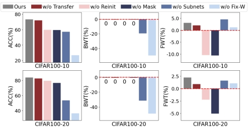 

 

 

MSTIL——sensitivity

***\*def sensitivity(data, z_lim, z_ticks, mean, std):\****

 

1.函数说明：生成超参数敏感性分析 3D 柱状图，展示两个超参数的不同组合对模型 FWT (%) 指标的影响

  

2.参数：

  data: 二维数组，形状为 (len(mean), len(std))，每个元素代表对应超参数组合下的 FWT (%) 值。

  z_lim:元组/列表，包含两个数值，分别为 Z 轴的最小值和最大值。

  z_ticks:列表/数组,Z 轴刻度的具体位置。

  mean:一维数组，代表 X-Y 平面中 Y 轴的超参数取值，长度为data的行数。

  std:一维数组，代表 X-Y 平面中 X 轴的超参数取值，长度为data的列数。

  

3.配色：

  colors = sns.color_palette('coolwarm', len(std))

  从冷色到暖色的连续渐变调色

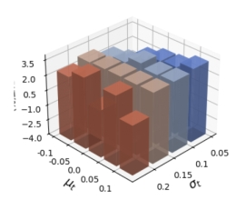 

 

MSTIL——task

***\*def task(data, task_num, dataset_name):\****

 

1.函数说明：绘制三个折线图（ACC、FWT、BWT），展示不同方法在多任务序列上的ACC、FWT和BWT的变化趋势。   

  

2.参数：

  data: 字典，第一层键为方法名称；第二层键为指标类型（"ACC"、"FWT"、"BWT"）；第三层为数值列表，元素个数对应任务的指标值，长度需与任务数量一致。

  task_num: 整数，任务的总数量，决定 X 轴的刻度范围。

  dataset_name：数据集名称，用于图片保存路径的命名。

 

3. 配色：

sns.set_theme(style="whitegrid", palette="muted")

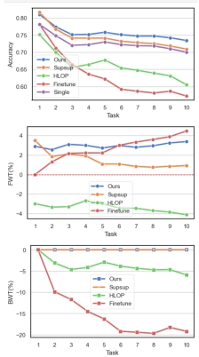 

Longtul——BrightkiteDrawACC

 根据准确率绘制折线图

 

  适用数据：多模型在分类任务中，准确率（Accuracy@1）随训练轮次（Epoch）变化的数据

 

  步骤：

  1.加载数据

  2.执行moving_average(data, window_size)

  3.绘制折线图

 

  配色：

  color='b' 蓝色

  color='g' 绿色

  color='r' 红色

  color='m' 品红色

  color='y' 黄色

  color='c' 青色

  color='orange' 橙色

  color='purple' 紫色

color='brown' 棕色

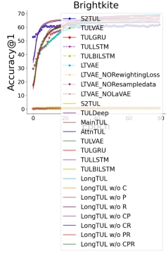 

 

Longtul——DrawLaplace

***\*def plot_multivariate_normal(mean, cov):\****

1.函数说明：绘制二维多变量正态分布的等高线图。

 

 2.参数:

  mean: 一维数组，二维正态分布的均值向量。 

  cov: 二维数组，协方差矩阵

 

3.配色：

  viridis 配色（从概率密度最低值到最高值，颜色依次呈现「深紫 → 靛蓝 → 青蓝 → 亮绿 → 明黄」的平滑过渡）

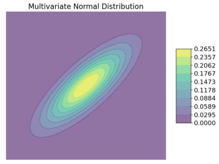 

 

Longtul——drawParameters

***\*def plot_drawParameters(datasets, performance_data,colors,param_values, param_type="Z"):\****

 

1.函数说明：绘制消融实验的柱状图对比。

 

2.参数:

  datasets: 字符串列表，数据集名称，定义 X 轴的类别

  performance_data: 嵌套列表，外层列表长度与datasets一致（每个元素对应一个数据集）；内层列表长度与param_values一致（每个元素对应参数的一个取值下的性能值）

  colors: 列表，长度与param_values一致，每个元素为颜色代码

  param_values: 列表，包含参数的所有实验取值

  param_type；表示参数的名称，用于图表标题和图例的命名

 

 3.配色：

  colors = [

​      (68/255,144/255,196/255),

​      (150/255,176/255,221/255),

​      (255/255,112/255,112/255),

​      (235/255,240/255,249/255),

​    ]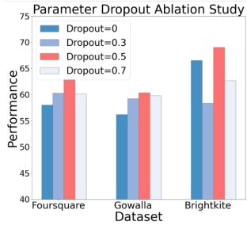

Longtul——counts_trajNums

def plot_Recombined_user_counts(datasets,datasets_resample):

1.函数说明：绘制多数据集用户轨迹数量分布对比图，通过三个并列子图展示不同数据集在原始和重采样后的用户轨迹数量分布差异

 

2.参数：

  datasets：字典列表，每个字典包含两个键：'file_path'：原始数据集的文件路径（txt 格式）； 'title'：数据集名称

  datasets_resample：字典列表，结构与 datasets 一致，但 'file_path' 指向重采样后的数据集文件路径

 

3.配色：

  color='#BEB8DC'

  color='#eb7765'

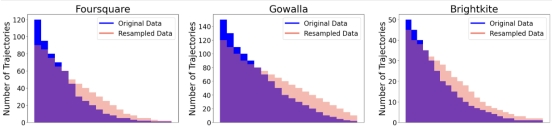 

ARC——参数_chi:

该代码适合用于可视化 3 类任务（如 CheckIn、Crime、ServiceCall）的 3 个参数（α、β、γ）对应的模型性能指标（R²），随对数间隔的 λ₁值变化的趋势数据，最终生成 1 行 3 列布局、带统一图例的 2D 折线图（每个参数对应 1 个子图）

  参数:

​    lambda1_values : list x 轴 λ1 值 (建议为对数间隔)

​    alpha_data : tuple(list, list, list) alpha 数据 (对应 legend_labels)

​    beta_data : tuple(list, list, list) beta 数据 (对应 legend_labels)

​    gamma_data : tuple(list, list, list) gamma 数据 (对应 legend_labels)

​    legend_labels : tuple(str, str, str) 图例名称

​    output_pdf : str 输出 PDF 文件路径

​    y_min, y_max : float Y 轴显示范围

 

  配色：

  color='#1f77b4'

  color='#ff7f0e'

  color='#2ca02c'

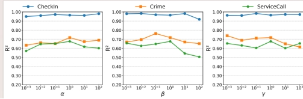 

 

ARC——参数_合起来画：

def plot_datasets_grid(datasets,random_prob,mask_ratio,titles,z_lims,z_ticks):

1. 函数说明：生成多城市 × 多任务的三维性能网格图，按 “城市（行）× 任务（列）” 排列，展示特定城市 + 任务组合下，性能指标（如 R²）随 X 轴（Local Ratio）和 Y 轴（Regional Ratio）变化的分布。

 

2.参数:

​    datasets : 字典，外层键为城市名称，内层键为任务名称，值为二维数组（性能数据，shape 与random_prob×mask_ratio对应）

​    random_prob : 一维数组，表示 Y 轴的变量取值

​    mask_ratio : 一维数组，表示 X 轴的变量取值

​    titles : 元组，长度与任务数量一致，每个元素为任务名称

​    z_lims : 元组，长度与任务数量一致，每个元素为(min, max)元组，表示每列的 z 轴范围

​    z_ticks : 元组长度与任务数量一致，每个元素为 Z 轴刻度数组

 

 3.配色：

  colors = plt.cm.coolwarm(np.linspace(0, 1, len(mask_ratio)))

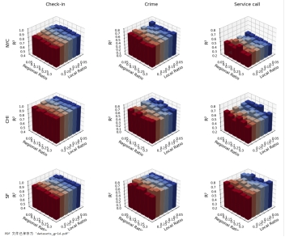 

ARC——参数mask的3d图

***\*def plot_3d_bars(datasets, random_prob, mask_ratio, z_lims, z_ticks, titles):\****

1.函数说明：生成1 行 N 列的三维柱状图网格（N 为任务数量，示例中为 3 列），每个子图对应一个任务，展示性能指标随两个变量的变化关系

 

2.参数:

​    datasets:列表， 每个元素为二维数组（shape 与random_prob×mask_ratio对应），代表一个任务的性能数据

​    random_prob: 一维数组，表示 Y 轴的变量取值

​    mask_ratio: 一维数组，表示 X 轴的变量取值

​    z_lims: 列表，每个元素为(min, max)元组，长度与任务数量一致，定义每个子图的 Z 轴范围

​    z_ticks: 列表，每个元素为 Z 轴刻度数组，长度与任务数量一致，定义每个子图的 Z 轴刻度

​    titles: 列表，每个元素为子图标题，长度与任务数量一致

​    

3.配色：

cmap='viridis'

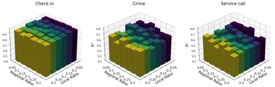 

 

ARC——参数敏感度

***\*def plot_cities_comparison(city_data_list, city_names, y_lims=None):\****

1.函数说明：生成多城市 × 多任务的性能对比柱状图，按 “城市” 横向排列子图（示例中 3 个城市对应 3 列子图），形成 1 行 ×N 列的网格，每个子图内对比 “3 个任务”（Check-in、Crime、Service call），子图间对比 “不同城市”，横坐标统一为 “掩码记录数”。

 

 2.参数：

  city_data_list : 字典列表

​    包含各城市数据的列表，每个元素是一个字典，必须包含以下键：

​    \- 'masked_records' : list[int] 或 list[float]，横轴刻度

​    \- 'check_in'    : list[float]，check-in 任务的 R² 值

​    \- 'crime'      : list[float]，crime 任务的 R² 值

​    \- 'service_call'  : list[float]，service call 任务的 R² 值

  city_names : 字符串列表，长度与city_data_list一致，每个元素为城市简称。

  y_lims : 元组或列表，控制 Y 轴范围

 

 3.配色：

  colors = ['#A1C9F4', '#B8E0A7', '#F5B5B5']

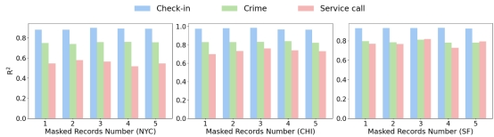 

ARC——时间和内容消耗

***\*def plot_model_comparison(models, sizes, times):\****   

1.函数说明：生成模型参数规模与运行时间的散点对比图

 

2.参数：

  models : 列表，模型名称列表

  sizes : 数组 / 列表，长度与 models 一致，每个元素为对应模型的参数规模

  times : 数组 / 列表，长度与 models 一致，每个元素为对应模型的运行时间

  

 

 3.配色：

  colors = ['#1f77b4', '#2ca02c', '#d62728', '#9467bd', '#8c564b']

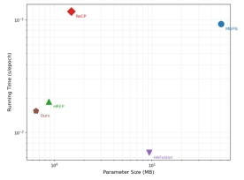 

ARC——画图对比

***\*Def plot_features(poi_data,mob_data,landuse_data,mask_poi,mask_mob, mask_landuse):\****

 

1. 函数说明：用于可视化多类型空间特征数据及其掩码（mask）处理结果，通过左右两个 3D 散点图对比展示：原始特征数据的空间分布（左图）；经掩码处理后的数据分布（右图，被掩盖的特征显示为灰色）。

 

2.参数：

  poi_data：二维数组（数值），表示不同区域的 POI（兴趣点）特征数据

  mob_data：二维数组（数值），表示不同区域的人类移动性特征数据

  landuse_data：二维数组（数值），表示不同区域的土地利用特征数据

  mask_poi：二维数组（0/1），与 poi_data 同形状，0 表示该位置特征被掩盖，1 表示保留。

  mask_mob：二维数组（0/1），与 mob_data 同形状，规则同上。

  mask_landuse：二维数组（0/1），与 landuse_data 同形状，规则同上。

 

3.配色：

  POI（兴趣点）特征数据：plt.cm.Blues

  人类移动性特征数据：plt.cm.Greens

  土地利用特征数据：plt.cm.Reds

  掩码部分：gray

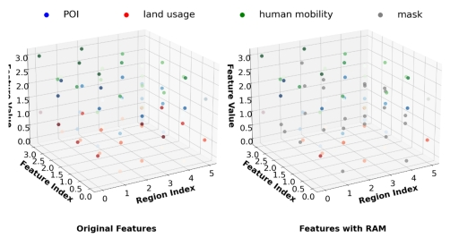 

ARC——消融

***\*def plot_ablation(tasks, methods, values):\****

 

1.函数说明：生成多任务消融实验性能对比柱状图，按 “任务” 横向排列子图，形成 1 行 ×3 列的网格，每个子图独立展示一个任务的消融结果。每个子图内对比多个模型变体的性能，直观呈现去除不同模块对模型性能的影响。 

 

 2.参数：

​    tasks: 列表，任务名称的列表

​    methods: 列表， 模型变体名称的列表，每个方法对应柱状图中的一个柱子

​    values:字典，键为任务名称（与 tasks 对应），值为该任务下各模型变体的性能值列表（长度与 methods 一致）。

 

 3.配色：

​    colors = ['#43978F', '#9EC4BE', '#FFB77F', '#59A14F', '#4E79A7', '#F19685', '#F6C957', '#E15759']

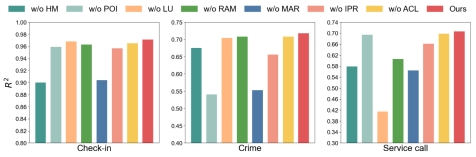 

画图——LineChart：

***\*def plot_LineChart(result_f1):\****

1.函数说明：绘制折线图，展示不同方法随任务推进的性能变化趋势

  

2.参数：

  result_f1；字典，键为方法名称，值为数值列表，每个元素对应不同时间点的F1-Macro值

 

3.配色；

  colors = ['#f57c6e', '#f2b56e', '#fbe79e', '#84c3b7', '#88d7da', '#71b8ed', '#b8aeea', '#f2a8da']

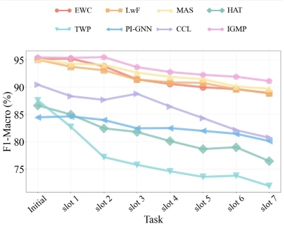 

画图——RadarChart：

***\*def plot_RadarChart(data):\****

1.函数说明：绘制多方法在多任务上的 F1 分数雷达图

  

2.参数：

  Data：字典键为方法名称,值为数值列表，每个元素对应不同任务（或时间槽）的 F1 值

 

3.配色：

  colors = ['#8dd3c7', '#ffffb3', '#bebada', '#fb8072', '#80b1d3', '#fdb462', 

​       '#b3de69', '#fccde5', '#ffed6f', '#bc80bd']

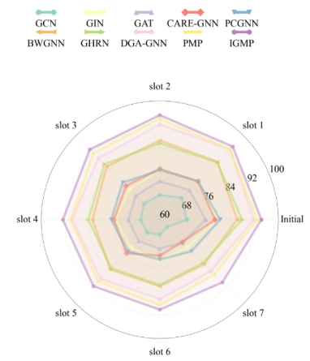 

画图——DumbbellPlot：

***\*def plot_DumbbellPlot(f1_data,auc_data):\****

1.函数说明：绘制哑铃图，对比同一模型在 F1-Macro 和 AUC 两个指标上的平均表现及波动范围

 

2.参数：

  f1_data：字典，键为模型名称；值为数值列表，每个元素对应模型在不同实验下的 F1-Macro 。

  auc_data：字典，键为模型名称，需与f1_data的键完全一致；值为数值列表，每个元素对应模型在相同实验下的 AUC 。

 

 3.配色：

  F1_color = '#3D5C6F'   # 蓝

  AUC_color= '#E47159'   # 橙

  line_color = '#D9D9D9'   # 连接线

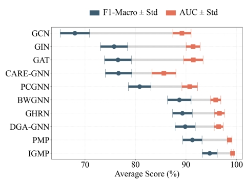 

画图——BarChart：

***\*def plot_BarChart(f1, auc, y_min, y_max):\****

1.函数说明：绘制柱状图，展示同一模型的不同变体（如去除某模块的模型）在 F1-Macro 和 AUC 两个指标上的性能差异

 

 2.参数：

  f1：字典，键为模型变体名称，值为单个数值，代表该模型的 F1-Macro 。

  auc：字典，键为模型变体名称，需与f1的键完全一致，值为单个数值，代表该模型的 AUC 。

  y_min：数值，Y 轴的最小值。

  y_max：数值，Y 轴的最大值。

 

 3.配色：

  F1_color = '#8FDEE3'   # 蓝

  AUC_color = '#F78779'  # 橙

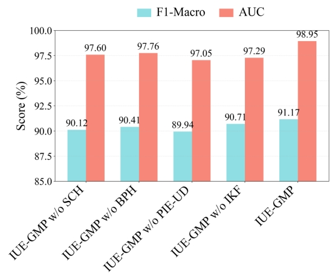 

画图代码——AULAB——MI

***\*def plot_MI(acc_values1,acc_values2, label1,label2,epochs = list(range(200)))：\****

 

1.函数说明：绘制折线图，图中两条折线分别对应两种方法的准确率随训练轮次的变化情况

 

2.参数：

  acc_values1：列表 / 数组（数值），第一个方法的准确率序列，长度需与训练轮次（epochs）一致

  acc_values2：列表 / 数组（数值），第二个方法的准确率序列，长度需与训练轮次（epochs）一致

  lables1:字符串，第一个标签名，用于图例和图表识别

  lables2:字符串，第二个标签名，用于图例和图表识别

  epochs：列表 / 数组，表示训练轮次

 

 3.配色：

  color1 = "#1F4C98"

  color2 = '#0393AF'

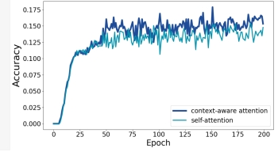 

画图代码——AULAB——time

***\*def plot_time(data, methods,ylabel='Time Cost (seconds)'):\****

1.函数说明：绘制不同方法在多个数据集上的时间成本对比柱状图

  

2.参数:

​    data: 字典，键为数据集名称，值为对应各方法的时间成本列表

​    methods: 列表，方法名称，需与data中每个值的顺序对应

​    ylabel: 字符串，y轴标签文本

 

3.配色： palette = ['#4C72B0', '#DD8452', '#55A868']

 

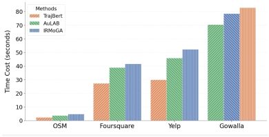 

 

画图代码——AULAB——单条轨迹热力图

***\*def plot_1_pred(poi_data)：\****

1.函数说明：将 POI（兴趣点）数据可视化为交互式热力图

 

2.参数：

  poi_data:嵌套列表，每个子列表包含两个字符串元素，分别表示 POI 的纬度和经度。 

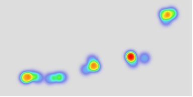 

画图代码——AULAB——消融

***\*def plot_ablation(data1,data2,labels):\****

 

1.参数说明：用于消融实验的结果可视化，包含两个子图，一个子图对应一个数据集，展示多个评估指标（Recall、F1、Accuracy）在不同数据集与不同模型变体上的表现

  

2.参数：

  data1：第一个数据集的性能指标数据，需为 3×6 的二维数组（3 行分别对应 Recall、F1、Accuracy；6 列对应 6 种方法）

  data2：第二个数据集的性能指标数据，格式同data1

  labels：列表，x 轴刻度标签列表，需包含 3 个元素（对应 3 种评估指标的类别）

 

 3.配色：

  colors = sns.color_palette("Set2", n_colors=6)

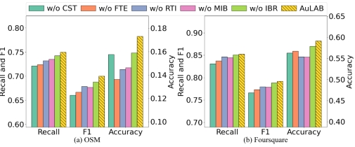 

画图代码——AULAB——超参

***\*def plot_hyperparameter(data1, x_labels):\****

1.函数说明：绘制多指标折线图，展示 3 个模型性能指标（Accuracy、Recall、F1）随某一超参数取值变化的趋势。

  

2.参数：

data1：二维数组，形状为 (3, n)，其中 n 为超参数取值数量，第 0 行对应Recall指标数据、第 1 行对应F1指标数据、第 2 行对应Accuracy指标数据。

x_labels：列表，长度为 n（与 data1 的列数一致），每个元素为超参数的具体取值，作为 x 轴刻度标签。  

 

 3.配色：sns.set_palette("pastel")

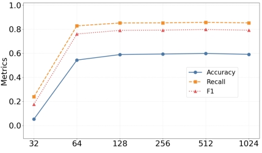 

画图代码——AULAB——热力图

***\*def plot_poi_heatmap(test_file_path, poi_file_path, venue_file_path):\****

1. 函数说明：绘制POI（兴趣点）的空间分布热力图

参数:

​    test_file_path (str): 包含预测POI的测试文件路径（每行格式：[其他信息] POI_ID1 POI_ID2 ...）

​    poi_file_path (str): 包含POI地理信息的文件路径（TSMC格式，含经纬度）

​    venue_file_path (str): 包含POI ID映射关系的文件路径（格式：VENUE_ID POI_ID）

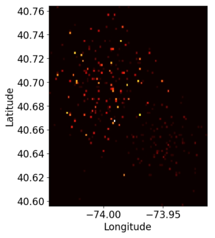 

画图代码——DTPTrajRec——Extreme case

***\*def plot_Extremecase(data, metrics,methods,datasets):\****

1.函数说明：绘制柱状图，一个数据集对应一个子图，比较数据集在不同方法运行下的结果指标

 

2.参数：

  data:双层嵌套字典， 第一层键为数据集名，第二层键为方法名，值为对应指标数值列表

  metrics：字符串列表，指标名称

  methods:字符串列表，方法名称

  datasets：字符串列表，数据集名称列表

 

 3.配色：

  colors = {'DTPTrajRec': '#4C72B0', 'MM-STGED': '#DD8452'}

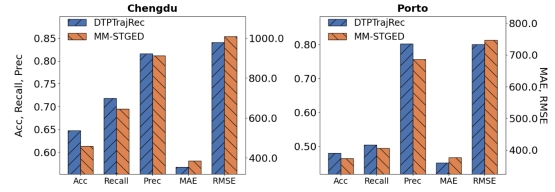 

 

画图代码——DTPTrajRec——data-limited

***\*plot_datalimited(keep_ratio, traindata_ratio, method1_metrics,method2_metrics, method1_name="MM-STGED", method2_name="DTPTrajRec"):\****

1.函数说明：绘制双方法、多指标的3D柱状图对比，展示不同keep_ratio和traindata_ratio下的性能差异。

  

2.参数：

  keep_ratio: 数值列表，第一个变量（Y轴）的取值

  traindata_ratio: 数值列表，第二个变量（X轴）的取值

  method1_metrics: 字典，方法1的5个指标数据，键为指标名（"Acc", "Recall", "Precision", "MAE", "RMSE"），值为数值列表

  method2_metrics: 字典，方法2的5个指标数据，格式同method1_metrics

  method1_name: 字符串，方法1的名称（用于图表标注），默认"MM-STGED"

  method2_name: 字符串，方法2的名称（用于图表标注），默认"DTPTrajRec"

 

3.配色：

  colors = sns.color_palette("coolwarm", n_colors=len(traindata_ratio))

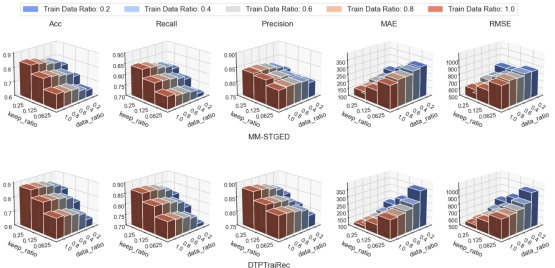 

 

画图代码——DTPTrajRec——超参

***\*def plot_TransitionMatrix(data):\****

1.函数说明：绘制1 行 2 列的子图，一个子图对应一个数据集，展示不同数据集在不同参数 k 取值下的多个模型性能指标（准确率、召回率、RMSE）变化趋势

 

2.参数：

  data:字典列表，每个字典代表 1 组实验数据，每个字典需包含 7个键：Dataset/k/acc/recall/Precision/mae/rmse

 

 3.配色：

  colors = {

​    'acc': 'tab:blue',

​    'recall': 'tab:green',

​    'Precision': 'tab:orange',

​    'mae': 'tab:red',

​    'rmse': '#6A84B7'

  }

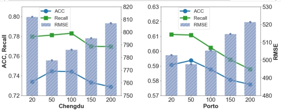 

 

 

MMAR——3d

***\*def plot_3d_parameter_effect(metric_column, metric_view, csv_path, save_name):\****

1.函数说明：绘制双参数（K：num_of_retrieved_items，M：num_of_retrieved_users）对模型性能指标的3D曲面影响图

  

2.参数:

​    metric_column:字符串，性能指标在CSV中的列名（如'acc'）

​    metric_view :字符串， 性能指标的显示名称（如'ACC'，用于图表标注）

​    csv_path :字符串， 包含参数与性能数据的CSV文件路径

​    save_name :字符串， 图像保存路径（如'fakeddit_acc.pdf'）

 

3.配色：

  fixed_color = 'RdYlBu_r'

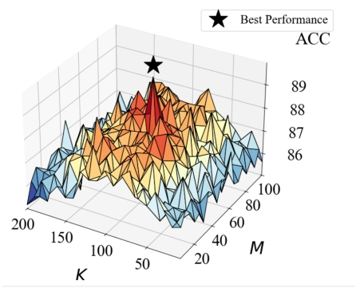 

MMAR——3d_v3

***\*def plot_smoothed_3d_parametric(metric_column, metric_view, dataset, csv_path, save_name):\****

1.函数说明：绘制双参数（K和M）对模型性能指标的平滑3D曲面图（带三次插值）

  

2.参数:

​    metric_column: 字符串，性能指标在CSV中的列名（如'acc'）

​    metric_view : 字符串，性能指标的显示名称（如'ACC'）

​    dataset:字符串， 数据集名称（用于特殊处理，如fakeddit的最优索引）

​    csv_path :字符串， 包含参数与性能数据的CSV文件路径

​    save_name:字符串， 图像保存路径（如'recovery_acc.pdf'）

 

3.配色：color='Spectral'

 

 

MMAR——roc

***\*def plot_roc_curve(n_samples, pos_ratio, target_auc):\****

1.函数说明：生成模拟的二分类数据并绘制ROC曲线

  

2.参数:

​    n_samples (int): 样本数量（默认1000）

​    pos_ratio (float): 正例比例（0~1，默认0.5）

​    target_auc (float): 目标AUC值（0.5~1.0，默认0.94）

​    random_seed (int): 随机种子（确保结果可复现，默认42）

​    title (str): 图表标题（默认'Receiver Operating Characteristic'）

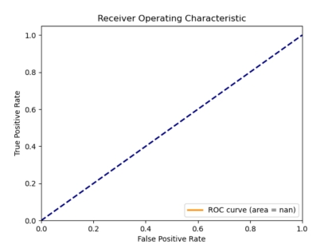 

MMAR——sim_dis_en

***\*def plot_sim_vs_accuracy(sim_data, pred_data, dataset_name):\****

1.函数说明：绘制文本相似度区间与模型准确率的关系图（固定区间划分和样式）

  

2.参数:

​    sim_data (list): 相似度数据列表，每个元素为{'id': 样本ID, 'sim': 余弦相似度}

​    pred_data (dict): 预测结果字典，键为样本ID，值为{'label': 真实标签, 'predict': 预测标签}

​    dataset_name (str): 数据集名称（用于生成保存文件名）

 

3.配色：

  bar_color = '#007175'

  line_color = '#422256'

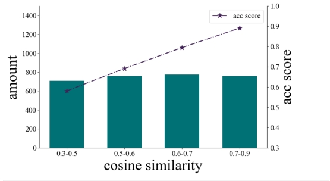 

MMAR——plot_sens_agg_fun-acc：

***\*def plot_agg_fun_performance(metric_column, datasets, agg_fun_labels, csv_paths, save_name):\****

  

1.函数说明： 绘制多个数据集在不同聚合函数下的性能指标趋势图（固定样式和范围）

  

2.参数:

​    metric_column (str): 性能指标列名（如'acc'）

​    datasets (list): 数据集名称列表（如['fakeddit', 'recovery', 'covid']）

​    agg_fun_labels (list): 聚合函数标签（X轴分类，如['softmax_then_sum', 'mean', 'sum']）

​    csv_paths (list): 每个数据集对应的CSV文件路径列表（与datasets顺序一致）

​    save_name (str): 图像保存路径

 

3.配色：marker_colors = ['#2E8B57', '#376795', '#B91419']

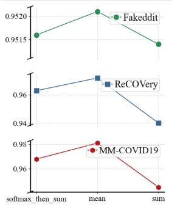 

 

 

